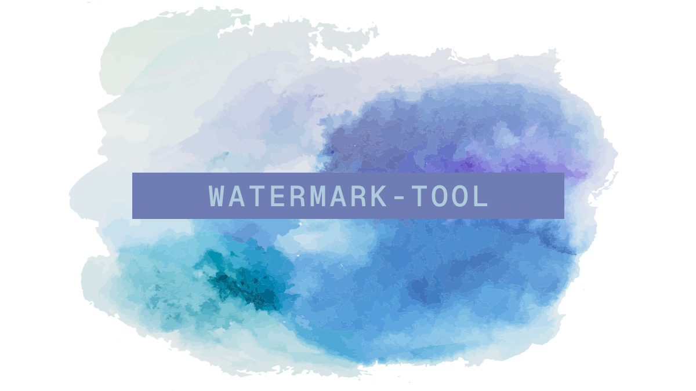

# watermark-tool

`watermark-tool`은 2D 이미지를 위한 워터마크 삽입 자동화 도구입니다.

- 이미지에서 감지된 얼굴 밑에 자동으로 워터마크를 삽입합니다.
- AI기반 워터마크 제거 도구의 워터마크 제거 시도를 효과적으로 방어합니다.


## 시작하기

### 1. watermark-tool 다운로드

1. [Releases](https://github.com/AkeboshiHimari/watermark-tool/releases/)에서 최신 버전의 파일을 다운로드합니다.
2. 다운로드한 파일의 압축을 풉니다.

### 2. Python 설치

최신 버전의 Python을 설치합니다. [Python 다운로드](https://www.python.org/ftp/python/3.12.5/python-3.12.5-amd64.exe)

> [!TIP]
>
> 컴퓨터의 운영 체제 버전이 Windows 11 또는 Windows 10 1709(빌드 16299) 이상인 경우, **winget**을 이용해 설치를 진행할 수 있습니다.
>
> 시작 메뉴에서 **Windows Powershell**을 실행하고 다음 명령어를 입력하세요.
>
> ```powershell
> winget install -e --id Python.Python.3.12
> ```

### 3. Python 의존성 설치

1. 압축을 푼 `watermark-tool` 폴더로 이동합니다.
2. `Shift  + 마우스 오른쪽 클릭` 후 **여기에 PowerShell 창 열기**를 클릭합니다.
3. 다음 명령어를 입력합니다. 

    ```powershell
    pip install -r requirements.txt
    ```

### 4. 얼굴 인식 모델 및 폰트 다운로드

1. PowerShell 창에 다음 명령어를 입력하여 얼굴 인식 모델을 다운로드합니다.

	- 얼굴 인식 모델 출처: [deepghs/anime_face_detection](https://huggingface.co/deepghs/anime_face_detection)

    ```powershell
    Invoke-WebRequest -Uri "https://huggingface.co/deepghs/anime_face_detection/resolve/main/face_detect_v1.4_s/model.pt?download=true" -OutFile "./model.pt"
    ```

2. PowerShell 창에 다음 명령어를 입력하여 폰트를 다운로드합니다.

   - 폰트 출처: [Pretendard](https://github.com/orioncactus/pretendard)

    ```powershell
    Invoke-WebRequest -Uri "https://github.com/orioncactus/pretendard/raw/main/packages/pretendard/dist/public/variable/PretendardVariable.ttf" -OutFile "./font.otf"
    ```
    > [!TIP]
    > 커스텀 폰트를 사용하려면 사용할 폰트 파일을 `watermark-tool`폴더로 옮긴 후 폰트 파일 이름을 `font.otf`로 변경하거나 또는 `watermark.py` 파일 아래에서 두번째 줄의 `font_path = "font.otf"`에서 `font.otf`파일을 원하는 폰트의 파일명으로 수정합니다.
    >
    > ```python
    > if __name__ == "__main__":
    > 	...
    >     	font_path = "font.otf" # 여기를 원하는 폰트 파일명으로 수정
    > 	...
    > ```


## 사용하기

1. `input`폴더에 처리할 이미지들을 넣습니다.

2. PowerShell 창에 다음 명령어를 입력합니다.

   ```powershell
   py watermark.py
   ```

3. 워터마크 적용 완료된 이미지는 `output`폴더에서 확인할 수 있습니다.


## 예시

> [!NOTE]
>
> 이 설명서에 넣을 예시 일러스트 이미지를 구하고 있습니다. 일러스트 이미지를 제공해주실 분은 문의 남겨주세요.


## 문의하기

사용중 문의사항이 있다면 Issue를 남기거나 또는 DM 보내주세요.

- [Issue 등록하기](https://github.com/AkeboshiHimari/watermark-tool/issues)
- [@Lag_L2p로 DM 보내기](https://x.com/Lag_L2p)


## TODO
- [ ] 사용자 지정 문구 지원
- [ ] 사용자 지정 이미지 지원
- [ ] SD 스타일 이미지에 대한 지원 강화
- [ ] GUI (Web UI) 지원
- [ ] 워터마크를 적용하지 않을 대상 선택기능 추가


## 기여하기

여러분의 기여를 환영합니다. 자세한 내용은 기여 가이드라인을 확인해 주세요.

