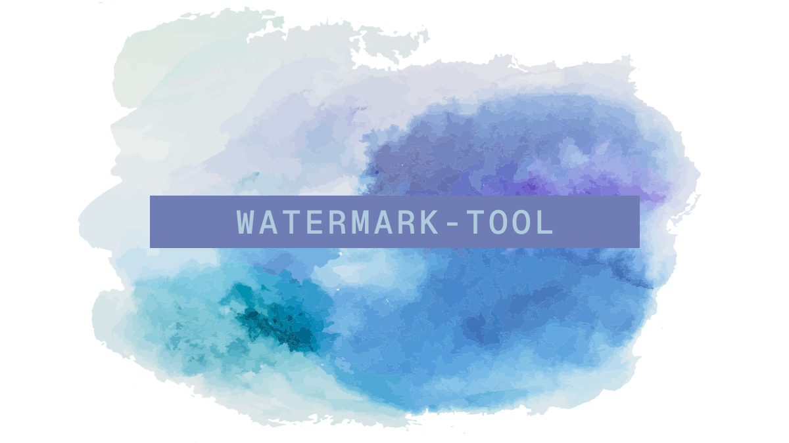

# watermark-tool

`watermark-tool`은 2D 이미지를 위한 워터마크 삽입 자동화 도구입니다.

- 이미지에서 감지된 얼굴 밑에 자동으로 워터마크를 삽입합니다.
- AI기반 워터마크 제거 도구의 워터마크 제거 시도를 효과적으로 방어합니다.


## 시작하기

### 1. watermark-tool 다운로드

1. [Releases](https://github.com/AkeboshiHimari/watermark-tool/releases/)에서 최신 버전의 파일을 다운로드합니다.
2. 다운로드한 파일의 압축을 풉니다.


### 2. Python 설치

최신 버전의 Python을 설치합니다. [Python 다운로드](https://www.python.org/ftp/python/3.12.5/python-3.12.5-amd64.exe)

> [!TIP]
>
> 컴퓨터의 운영 체제 버전이 Windows 11 또는 Windows 10 1709(빌드 16299) 이상인 경우, **winget**을 이용해 설치를 진행할 수 있습니다.
>
> 시작 메뉴에서 **Windows Powershell**을 실행하고 다음 명령어를 입력하세요.
>
> ```powershell
> winget install -e --id Python.Python.3.12
> ```


### 3. Python 의존성 설치

1. 압축을 푼 `watermark-tool` 폴더로 이동합니다.
2. `Shift  + 마우스 오른쪽 클릭` 후 **여기에 PowerShell 창 열기**를 클릭합니다.
3. 다음 명령어를 입력합니다. 

    ```powershell
    pip install -r requirements.txt
    ```


### 4. 얼굴 인식 모델 및 폰트 다운로드

1. PowerShell 창에 다음 명령어를 입력하여 얼굴 인식 모델을 다운로드합니다.

	- 얼굴 인식 모델 출처: [deepghs/anime_face_detection](https://huggingface.co/deepghs/anime_face_detection)

    ```powershell
    Invoke-WebRequest -Uri "https://huggingface.co/deepghs/anime_face_detection/resolve/main/face_detect_v1.4_s/model.pt?download=true" -OutFile "./model.pt"
    ```

2. PowerShell 창에 다음 명령어를 입력하여 폰트를 다운로드합니다.

   - 폰트 출처: [Pretendard](https://github.com/orioncactus/pretendard)

    ```powershell
    Invoke-WebRequest -Uri "https://github.com/orioncactus/pretendard/raw/main/packages/pretendard/dist/public/variable/PretendardVariable.ttf" -OutFile "./font.otf"
    ```
    > [!TIP]
    > 커스텀 폰트를 사용하려면 사용할 폰트 파일을 `watermark-tool`폴더로 옮긴 후 폰트 파일 이름을 `font.otf`로 변경하거나 또는 `watermark.py` 파일 아래에서 두번째 줄의 `font_path = "font.otf"`에서 `font.otf`파일을 원하는 폰트의 파일명으로 수정합니다.
    >
    > ```python
    > if __name__ == "__main__":
    > 	...
    >     	font_path = "font.otf" # 여기를 원하는 폰트 파일명으로 수정
    > 	...
    > ```


## 사용하기

1. `input`폴더에 처리할 이미지들을 넣습니다.

2. PowerShell 창에 다음 명령어를 입력합니다.

   ```powershell
   py watermark.py
   ```

3. 워터마크 적용 완료된 이미지는 `output`폴더에서 확인할 수 있습니다.


### 사용자 지정

명령행 인자로 워터마크를 사용자화 할 수 있습니다.

- `-t`: 워터마크 텍스트 지정.
- `-l`: 로고 이미지 사용.
- `-w`: 가로 길이
- `-y`: 세로 위치 

옵션에 대한 설명을 보려면 다음 명령어를 입력하세요.

```powershell
py watermark.py -help
```


#### 사용자 지정 텍스트

워터마크에 기본 "SAMPLE" 문구 대신 다른 문구를 표시하려면 다음 명령어를 입력하세요. `워터마크 텍스트` 부분을 원하는 텍스트로 수정해야 합니다.

```powershell
py watermark.py -t "워터마크 텍스트"
```

이렇게 하면 **워터마크 텍스트** 문구가 표시됩니다.

> [!WARNING]
>
> 사용자 지정 텍스트는 반드시 **큰 따옴표(" ")**로 감싸야 합니다.
>
> - 올바른 예시: `py watermark.py -t "워터마크 텍스트"`
> - 잘못된 예시: `py watermark.py -t 워터마크 텍스트`


#### 로고 이미지

워터마크에 텍스트 대신 로고를 표시하려면 다음 명령어를 입력하세요. `my-logo.png` 부분을 실제 파일명, 경로로 수정해야 합니다.

```powershell
py watermark.py -l my-logo.png
```

이렇게 하면 텍스트 대신 로고가 표시됩니다.

> [!NOTE]
>
> `.png`, `.webp` 이미지 사용을 권장합니다. `.jpg`이미지도 사용할 수 있으나 로고가 손상될 수 있습니다.
>
> 로고 이미지는 흑백 -> 밝기 100% -> 색상 적용의 보정 과정을 거칩니다. 이 과정에서 로고의 내부 디테일은 손실되며, 최종적으로 로고의 실루엣만 표시됩니다.


> [!IMPORTANT]  
> 
> 워터마크 텍스트와 로고는 동시에 적용할 수 없습니다. 예를 들어 `py watermark.py -l my-logo.png -t "my text"`로 실행한 경우, 텍스트는 무시됩니다.


#### 워터마크 너비

워터마크 너비를 조절하려면 다음 명령어를 입력하세요. 기본값은 `2.0`입니다.

`2.5` 부분을 원하는 수치로 수정해야 합니다.

```powershell
py watermark.py -w 2.5
```

워터마크 너비는 이미지에서 감지된 각 얼굴의 너비에 따라 달라집니다. 계산식은 다음과 같습니다.

```
워터마크 너비 = 감지된 얼굴 너비 * 사용자 입력값 
```

예를 들어 감지된 얼굴의 너비가 50px이고 `-w 2.5` 옵션을 적용한 경우 워터마크 너비는 125px입니다.


#### 워터마크 위치

워터마크 위치를 조절하려면 다음 명령어를 입력하세요. 기본값은 `0.5`입니다.

`1.0` 부분을 원하는 수치로 수정해야 합니다.

```powershell
py watermark.py -y 1.0
```

워터마크 위치는 이미지에서 감지된 얼굴의 높이에 따라 달라집니다. 계산식은 다음과 같습니다.

```
워터마크 위치(y) = 감지된 얼굴의 밑면(y) + 감지된 얼굴의 높이 * 사용자 입력값
```

예를 들어 감지된 얼굴의 밑면이 300px 지점에 위치하고 얼굴의 높이가 100px이며 `-y 1.0` 옵션을 적용한 경우 워터마크는 400px 지점에 생성됩니다.


#### 사용자 지정 옵션 조합

여러 옵션을 조합하여 한번에 적용할 수 있습니다.

예를 들어, 입력한 텍스트가 너무 길어 텍스트가 워터마크 배경을 벗어나고, 워터마크 위치를 아래로 옮겨야 하는 상황을 가정해 봅시다. 이때는 다음과 같이 입력하면 됩니다.

```powershell
py watermark.py -t "좀 긴 텍스트" -w 2.5 -y 1.5
```

`-t`, `-w`, `-y` 순서는 결과에 영향을 미치지 않습니다.


## 예시

> [!NOTE]
>
> 이 설명서에 넣을 예시 일러스트 이미지를 구하고 있습니다. 일러스트 이미지를 제공해주실 분은 문의 남겨주세요.


## 문의하기

사용중 문의사항이 있다면 Issue를 남기거나 또는 DM 보내주세요.

- [Issue 등록하기](https://github.com/AkeboshiHimari/watermark-tool/issues)
- [@Lag_L2p로 DM 보내기](https://x.com/Lag_L2p)


## TODO
- [ ] 사용자 지정 문구 지원
- [ ] 사용자 지정 이미지 지원
- [ ] SD 스타일 이미지에 대한 지원 강화
- [ ] GUI (Web UI) 지원
- [ ] 워터마크를 적용하지 않을 대상 선택기능 추가


## 기여하기

여러분의 기여를 환영합니다. 편하게 기여해주세요.

커밋, PR 메시지는 다음과 같이 작성해주세요.

```
<type>: <description>
```

**Type은 다음 중 하나여야 합니다.**

코드가 변경된 경우

- `feat`: 새로운 기능 추가
- `update`: 기존 기능 개선
- `fix`: 오류 수정

코드가 변경되지 않은 경우

- `docs`: 문서 변경

기타

- `chore`: 그 외
